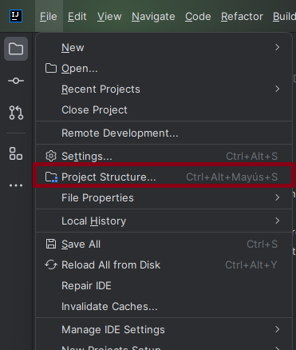
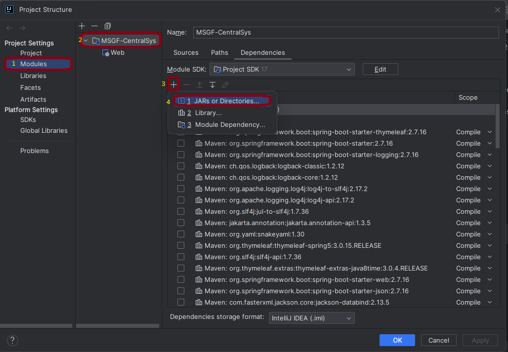
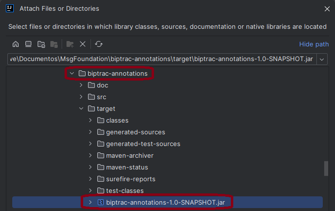

# biptrac-annotations
This repository contains the annotations definition to MSG-Foundation project

## Index

1. [Description](#description)
2. [Prerequisites](#prerequisites)
3. [Usage](#usage)
4. [Annotations Library Configuration](#annotations-library-configuration)


## Description

A Java annotation library is a set of custom annotations that are added to the source code to provide additional metadata. In this particular case, annotations are used to analyze the traceability between the MSGFoundation project and its respective BPMN model. These annotations allow marking code elements such as Java classes, attributes and methods to relate them to tasks and process variables. 


## Prerequisites

To use this program you need the following:

1. **Version control system**: Install GIT from the [GIT official website](https://git-scm.com/downloads).


2. **IntelliJ IDEA**: To run and/or modify the project, you can download it from the [IntelliJ official website](https://www.jetbrains.com/es-es/idea/download/?section=windows).

3. **Java 17 or higher**: You can get help to download and install the java version by following [this link](https://www.youtube.com/watch?v=oAin-q1oTDw&pp=ygUXY29tbyBjb25maWd1cmFyIGphdmEgMTc%3D)

4. **Maven 3.9**: You can get help to download and install the maven version by following [this link](https://www.youtube.com/watch?v=1QfiyR_PWxU&pp=ygUSaW5zdGFsYXIgbWF2ZW4gMy45)


## Usage

To use the program you must do:

1. Open a terminal in the folder where you want to download the program and clone it with:

   ```
   git clone https://github.com/BPMN-sw-evol/biptrac-annotations.git
   ```

2. Open the **biptrac-annotations** folder with a Windows terminal or console and type the following command:
   ```
   mvn clean package
   ```
   You must have installed a Maven version

3. The previous command generates a folder called target where there will be a .jar file which can be used in the other projects to use the annotations.

4. You are done! You can use the annotations library.

## Annotations Library Configuration

1. Clic on "Project Structure"



2. Clic on Modules > projectName > + > JARs or Directories...



3. Search the biptrac-annotations project and select the biptrac-annotations-1.0-SNAPSHOT.jar 



4. Ready! You can use the annotations into your project.